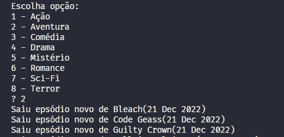

# Anime Releases

Aplicação que busca animes de acordo com o gênero que o usuário escolhe, então, notifica-o quando há um novo epsodio lançado.

## Instalação
- ReactiveXJS - `npm install rxjs`
- TypeScript - `npm install typescript`
- Outras dependências - `npm install`

## Aluno: 
- Josué Leite

